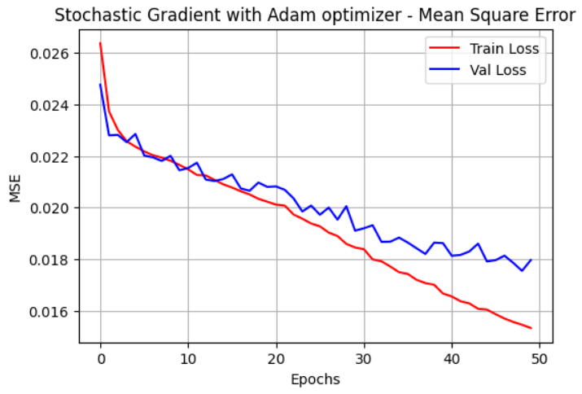
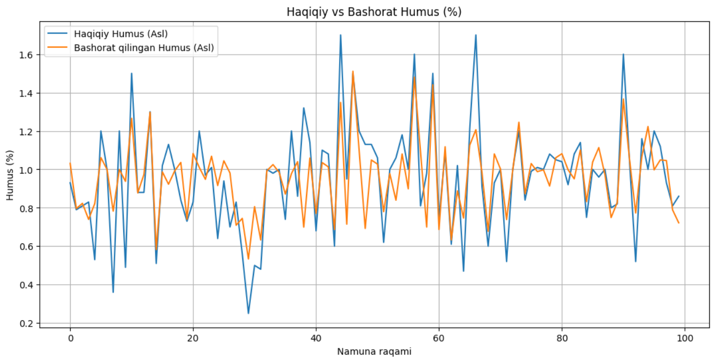

# soil-humus-forecasting-prediction-lstm
LSTM-based deep learning model for predicting soil humus percentage using spatial, temporal, and chemical features.

# 🌱 Humus Prediction using LSTM

This project uses a Long Short-Term Memory (LSTM) neural network to predict the percentage of **humus** in soil. The model considers both spatial and temporal features, as well as chemical soil composition and regional factors.

>  <

---

## 📌 Project Goal

To forecast **Humus (%)** using:
- 📍 **Geographic location**: latitude, longitude
- 🧪 **Chemical features**: P2O5, K2O
- 🗓️ **Temporal features**: year, month, day
- 🗺️ **Categorical district encoding**

This can assist:
- Farmers for better crop planning 🌾
- Soil scientists for deeper analysis 🌍
- AI engineers for agri-based forecasting models 🤖

---

## 🔍 Features

✅ Cleans and preprocesses soil dataset  
✅ Handles categorical data (districts) with label encoding  
✅ Normalizes the features with `MinMaxScaler`  
✅ Generates time series sequences for LSTM training  
✅ Trains a 2-layer LSTM model with dropout and dense layers  
✅ Plots training/validation loss & prediction comparison  
✅ R² score for performance evaluation  
✅ Compatible with **Google Colab**

---

## 📊 Visual Results

### 📉 Loss Curve

### 📈 Predicted vs Actual Humus (%)

---

## 🧠 Technologies Used

- Python 🐍
- Pandas, NumPy, Scikit-learn
- TensorFlow / Keras
- Matplotlib / Seaborn
- Google Colab ☁️
